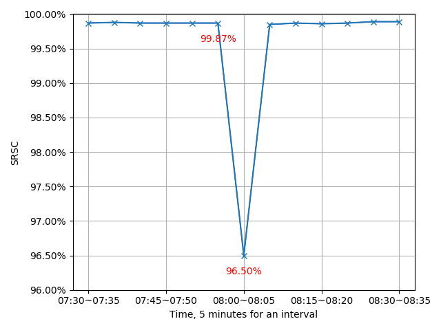

# ImpAPTr

[中文版](./README_zh.md) | English

ImpAPTr (Impact Analysis based on Pruning Tree) is a tool for identifying clues to online service anomalies by analyzing multi-dimensional attributes in service call data.

## About

This is the artifact repository for the paper:

**Wang, Hao, Rong, Guoping, Xu, Yangchen, and You, Yong.** "ImpAPTr: a tool for identifying the clues to online service anomalies." *Proceedings of the 35th IEEE/ACM International Conference on Automated Software Engineering (ASE '20)*, 2021, pp. 1307-1311. DOI: [10.1145/3324884.3415301](https://doi.org/10.1145/3324884.3415301)

### Extended Work

This work has been extended and published as:

**Rong, Guoping, Wang, Hao, Gu, Shenghui, Xu, Yangchen, Sun, Jialin, Shao, Dong, and Zhang, He.** "Locating Anomaly Clues for Atypical Anomalous Services: An Industrial Exploration." *IEEE Transactions on Dependable and Secure Computing*, vol. 20, no. 4, 2023, pp. 2746-2761. DOI: [10.1109/TDSC.2022.3181143](https://doi.org/10.1109/TDSC.2022.3181143)

The extended version (ImpAPTr+) addresses atypical anomalies by incorporating time dimensions and removing the fixed threshold constraint.

## Features

- **Multi-dimensional Analysis**: Analyzes service calls across multiple dimensional attributes (e.g., City, ISP, Platform, Network, etc.)
- **Root Cause Identification**: Identifies combinations of attributes that lead to service anomalies
- **Real-world Validation**: Evaluated on production data from Meituan, one of the largest online service providers
- **High Accuracy**: Outperforms previous tools in the field regarding anomaly detection accuracy

## Installation

### Prerequisites

- Python 3.x
- Required packages: numpy

### Setup

1. Clone this repository:
```bash
git clone https://github.com/wanghaao/ImpAPTr.git
cd ImpAPTr
```

2. Install dependencies:
```bash
pip install -r requirements.txt
```

## Dataset
There is a dataset of real service calls of MT. The first level directory represents the day of march and the second represents the different interval(5 minutes for an interval) of each day.

### Dataset1 
Dataset1 only contains total service calls of three days (i.e., 10,19,22 March) and some real anomalies used in the last part **"Example"** exist in this dataset.
Link : https://www.jianguoyun.com/p/De4m7c8QtbXZCBiktbID

### Dataset2
- This dataset contains 31 files of Jan and each file contains all service calls of each day.
- The first number of each line of a file represents the interval.
Link : https://www.jianguoyun.com/p/DTPfNicQtbXZCBiTtbID

**Attention**
- The dataset has been desensitized.
- ''A4,B0,C1,D1,E30,F9,G6055,2,200'' is a line of a file, and the first 7 values are the different dimensional values and the 8th value presents the number of service calls, further, the last is the status code of these service calls (200, the code for a successful service call, otherwise, failed).

Where:
- **First 7 values**: Different dimensional attribute values
  - A: Network type
  - B: Connection type
  - C: Platform
  - D: Operator
  - E: City
  - F: Source
  - G: (Additional dimension)
- **8th value**: Number of service calls
- **Last value**: HTTP status code (200 = successful, otherwise failed)

The first number of each line represents the time interval (5 minutes per interval).

## Usage

### Running the Tool

1. **Identify the Anomaly Interval**: When you observe a DSR (Declining Success Rate) in the SRSC (Success Rate of Service Calls), note the day and time interval where it occurs.



2. **Execute the Analysis**: Run the tool with the following command:

```bash
python ImpAPTr_test.py [day] [interval]
```

**Parameters**:
- `day`: The day of the month when DSR occurred
- `interval`: The time interval (in 5-minute increments) when DSR occurred

3. **Review Results**: The tool outputs candidate clues that can help operators identify the root cause and maintain service stability.

## Examples

We provide two real anomaly examples from March 2020:

### Example 1: Sharp DSR
**Time**: March 10, 2020, 08:00-08:05 (Interval 480)

```bash
python ImpAPTr_test.py 10 480
```

### Example 2: Slight Drop
**Time**: March 19, 2020, 11:20-11:25 (Interval 680)

```bash
python ImpAPTr_test.py 19 680
```

## Project Structure

```
ImpAPTr/
├── ImpAPTr_module/
│   ├── dataset/              # Data files (download separately)
│   ├── ImpAPTr.py            # Main algorithm implementation
│   ├── ImpAPTr_test.py       # Test script and entry point
│   └── success_rate_3.10.png # Example visualization
├── README.md                 # This file
├── README_zh.md              # Chinese version
├── requirements.txt          # Python dependencies
└── .gitignore                # Git ignore file
```

## Citation

If you use this tool in your research, please cite:

```bibtex
@inproceedings{10.1145/3324884.3415301,
  author = {Wang, Hao and Rong, Guoping and Xu, Yangchen and You, Yong},
  title = {ImpAPTr: a tool for identifying the clues to online service anomalies},
  year = {2021},
  isbn = {9781450367684},
  publisher = {Association for Computing Machinery},
  address = {New York, NY, USA},
  url = {https://doi.org/10.1145/3324884.3415301},
  doi = {10.1145/3324884.3415301},
  booktitle = {Proceedings of the 35th IEEE/ACM International Conference on Automated Software Engineering},
  pages = {1307–1311},
  numpages = {5},
  keywords = {clues identification, multi-dimensional attributes, success rate},
  location = {Virtual Event, Australia},
  series = {ASE '20}
}
```

For the extended work (ImpAPTr+):

```bibtex
@ARTICLE{9793673,
  author={Rong, Guoping and Wang, Hao and Gu, Shenghui and Xu, Yangchen and Sun, Jialin and Shao, Dong and Zhang, He},
  journal={IEEE Transactions on Dependable and Secure Computing}, 
  title={Locating Anomaly Clues for Atypical Anomalous Services: An Industrial Exploration}, 
  year={2023},
  volume={20},
  number={4},
  pages={2746-2761},
  doi={10.1109/TDSC.2022.3181143}
}
```

## License

Please refer to the license file or contact the authors for usage terms.

## Contact

For questions or issues, please open an issue on GitHub or contact the authors.
